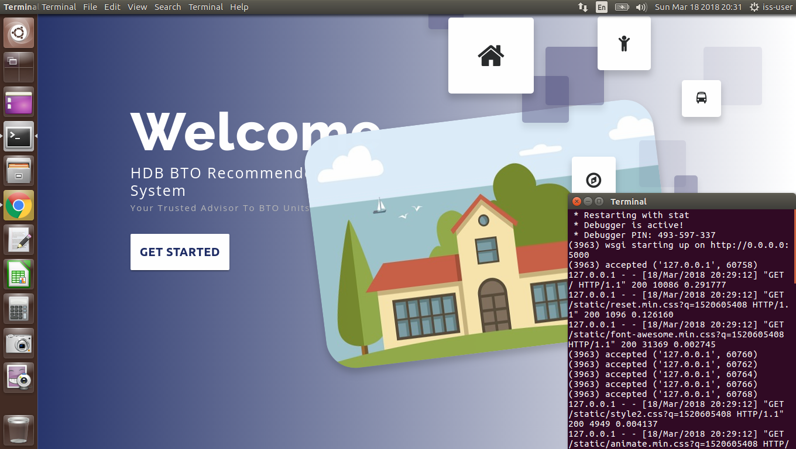

### 顾 瞻 GU Zhan (Sam)

zhan.gu@nus.edu.sg

---

# Singapore Housing & Deveoplment Board - BTO Recommender System

### Credits
### Project members of Institute of Systems Science, National University of Singapore:
* Desmond Chua
* Chang Ye Han
* Chee Jia Wei
* Ganesh Kumar
* Goh Yu Chen
* Jeanette Lim

### [ 1 ] To run the program using iss-vm

download pre-built virtual machine from http://bit.ly/iss-vm

start iss-vm

open terminal in iss-vm

$ git clone https://github.com/telescopeuser/bto-recommender-system.git

$ source activate iss-env-py2

(iss-env-py2) $ cd bto-recommender-system/clips

(iss-env-py2) $ python app.py

### Go to this URL using web browser
http://0.0.0.0:5000 or http://127.0.0.1:5000

### [ 2 ] To run the program in other/local machine:
### Install additional necessary libraries. This application works in python 2 only.

$ sudo apt-get install python-clips clips build-essential libssl-dev libffi-dev python-dev python-pip

$ pip install pyclips flask flask-socketio eventlet simplejson pandas

---

https://s3-eu-west-1.amazonaws.com/fayimora.com/2017/04/RoadToDataScientist1.png

